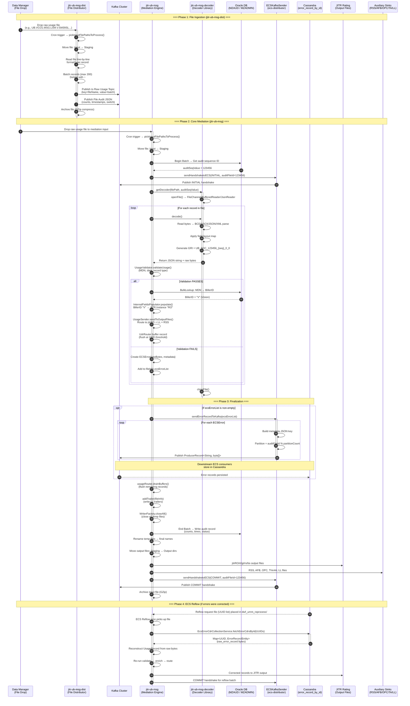

# Single Call Event Flow Through UB Pipeline

```mermaid
sequenceDiagram
    autonumber
    participant DM as Data Manager<br/>(File Drop)
    participant DIST as jitr-ub-msg-dist<br/>(File Distributor)
    participant KAFKA as Kafka Cluster
    participant MED as jitr-ub-msg<br/>(Mediation Engine)
    participant DEC as jitr-ub-msg-decoder<br/>(Decoder Library)
    participant ORACLE as Oracle DB<br/>(MZAUD / MZADMIN)
    participant ECS_K as ECSKafkaSender<br/>(ecs-distributor)
    participant CASS as Cassandra<br/>(error_record_by_id)
    participant JITR as JITR Rating<br/>(Output Files)
    participant AUX as Auxiliary Sinks<br/>(RSS/AFB/OPC/TA/LL)

    Note over DM,AUX: === Phase 1: File Ingestion (jitr-ub-msg-dist) ===

    DM->>DIST: Drop raw usage file<br/>(e.g., UB.VCO1.MSG.LSM.V.SM39SL...)
    activate DIST
    DIST->>DIST: Cron trigger → pickInputFilePathsToProcess()
    DIST->>DIST: Move file: Input → Staging
    DIST->>DIST: Read file line-by-line<br/>format() per record
    DIST->>DIST: Batch records (max 200)<br/>Delimit with ~
    DIST->>KAFKA: Publish to Raw Usage Topic<br/>(key=fileName, value=batch)
    DIST->>KAFKA: Publish File Audit JSON<br/>(counts, timestamps, switch)
    DIST->>DIST: Archive file (GZip compress)
    deactivate DIST

    Note over DM,AUX: === Phase 2: Core Mediation (jitr-ub-msg) ===

    DM->>MED: Drop raw usage file to mediation input
    activate MED
    MED->>MED: Cron trigger → pickInputFilePathsToProcess()
    MED->>MED: Move file: Input → Staging

    MED->>ORACLE: Begin Batch → Get audit sequence ID
    ORACLE-->>MED: auditSeqValue = 123456

    MED->>ECS_K: sendHandshaketoECS(INITIAL, auditFileId=123456)
    ECS_K->>KAFKA: Publish INITIAL handshake

    MED->>DEC: getDecoder(filePath, auditSeqValue)
    activate DEC
    DEC->>DEC: openFile() → FileChannel/BufferedReader/JsonReader

    loop For each record in file
        MED->>DEC: decode()
        DEC->>DEC: Read bytes → BCD/ASCII/JSON/XML parse
        DEC->>DEC: Apply field layout map
        DEC->>DEC: Generate GRI = UB_SDC_123456_{seq}_0_0
        DEC-->>MED: Return JSON string + raw bytes

        MED->>MED: UsageValidator.validateUsage()<br/>(MDN, date, record type)

        alt Validation PASSES
            MED->>ORACLE: BulkLookup: MDN → BillerID
            ORACLE-->>MED: BillerID = "V" (Vision)
            MED->>MED: InternalFieldsPopulator.populate()<br/>BillerID "V" → JITR Instance "RO"
            MED->>MED: UsageSender.sendToOutputFiles()<br/>Route to jitrRO + LL + RSS
            MED->>MED: UdrRouter buffer record<br/>(flush at 1000 threshold)
        else Validation FAILS
            MED->>MED: Create ECSError{rawBytes, metadata}
            MED->>MED: Add to fileInfo.ecsErrorList
        end
    end

    DEC->>DEC: closeFile()
    deactivate DEC

    Note over MED,CASS: === Phase 3: Finalization ===

    opt If ecsErrorList is non-empty
        MED->>ECS_K: sendErrorRecordToKafka(ecsErrorList)
        activate ECS_K
        loop For each ECSError
            ECS_K->>ECS_K: Build metadata JSON key
            ECS_K->>ECS_K: Partition = auditFileId % partitionCount
            ECS_K->>KAFKA: Publish ProducerRecord<String, byte[]>
        end
        deactivate ECS_K
        Note over KAFKA,CASS: Downstream ECS consumers<br/>store in Cassandra
        KAFKA-->>CASS: Error records persisted
    end

    MED->>MED: usageRouter.drainBuffers()<br/>(flush remaining records)
    MED->>MED: addTrailer(fileInfo)<br/>(write LL trailers)
    MED->>MED: WriterFactory.closeAll()<br/>(close all temp files)

    MED->>ORACLE: End Batch → Write audit record<br/>(counts, times, status)

    MED->>MED: Rename temp files → final names
    MED->>MED: Move output files: Staging → Output dirs

    MED->>JITR: jitrRO/rt/gt/rs/bs output files
    MED->>AUX: RSS, AFB, OPC, ThinAir, LL files

    MED->>ECS_K: sendHandshaketoECS(COMMIT, auditFileId=123456)
    ECS_K->>KAFKA: Publish COMMIT handshake

    MED->>MED: Archive input file (GZip)
    deactivate MED

    Note over DM,AUX: === Phase 4: ECS Reflow (if errors were corrected) ===

    CASS-->>MED: Reflow request file (UUID list) placed in dwf_umm_reprocess/
    activate MED
    MED->>MED: ECS Reflow cron picks up file
    MED->>CASS: EcsErrorCdrCollectionService.fetchErrorCdrsById(UUIDs)
    activate CASS
    CASS-->>MED: Map<UUID, ErrorRecordEntity><br/>(raw_error_record bytes)
    deactivate CASS
    MED->>MED: Reconstruct UsageRecord from raw bytes
    MED->>MED: Re-run validate → enrich → route
    MED->>JITR: Corrected records to JITR output
    MED->>ECS_K: COMMIT handshake for reflow batch
    deactivate MED
```
