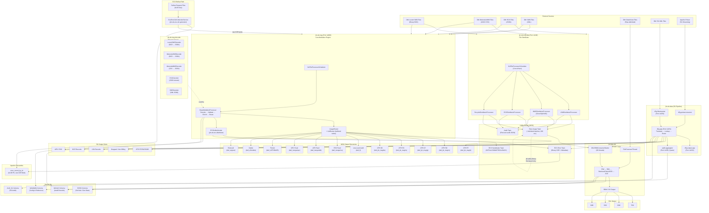

# UB Ecosystem — End-to-End Data Flow Architecture

```mermaid
flowchart TB
    subgraph SOURCES["External Sources"]
        DM_LSM["DM: Lucent SMS Files\n(Binary BCD)"]
        DM_MMS["DM: Motorola MMS Files\n(ASCII CSV)"]
        DM_RCS["DM: RCS Files\n(JSON)"]
        DM_SMS["DM: SMS Files\n(XML)"]
        DM_DATA["DM: Data/Voice Files\n(Pipe-delimited)"]
        DM_5G["DM: 5G XML Files"]
        PULSAR["Apache Pulsar\n(5G Streaming)"]
    end

    subgraph DIST["jitr-ub-msg-dist (Port 14190)\nFile Distributor"]
        DIST_SCHED["NUFileProcessorScheduler\n(Cron-driven)"]
        DIST_LSM["LSMDistributorProcessor"]
        DIST_MMS["MMSDistributorProcessor\n(Clone/Split MO)"]
        DIST_RCS["RCSDistributorProcessor"]
        DIST_RECYC["RecycleDistributorProcessor"]
        DIST_SCHED --> DIST_LSM & DIST_MMS & DIST_RCS & DIST_RECYC
    end

    subgraph KAFKA_MSG["Kafka Cluster (MSG)"]
        RAW_TOPIC["Raw Usage Topic\n(~delimited batches, 200 rec)"]
        AUDIT_TOPIC["Audit Topic\n(File-level audit JSON)"]
        ECS_TOPIC["ECS Error Topic\n(Binary CDR + Metadata)"]
        ECS_HS_TOPIC["ECS Handshake Topic\n(INITIAL/COMMIT/ROLLBACK)"]
    end

    subgraph DECODER["jitr-ub-msg-decoder\n(Shared Library)"]
        DEC_LSM["LucentSMSDecoder\n(BCD → JSON)"]
        DEC_MSMS["MotorolaSMSDecoder\n(BCD → JSON)"]
        DEC_MMS["MotorolaMMSDecoder\n(CSV → JSON)"]
        DEC_RCS["RCSDecoder\n(JSON stream)"]
        DEC_SMS["SMSDecoder\n(XML DOM)"]
    end

    subgraph MEDIATION["jitr-ub-msg (Port 14060)\nCore Mediation Engine"]
        MED_SCHED["NUFileProcessorScheduler"]
        MED_PROC["BaseMediationProcessor\nDecode → Validate → Enrich → Route"]
        MED_ROUTER["UsageRouter\n+ UdrRouter (buffered writes)"]
        MED_ECS["ECSKafkaSender\n(jitr-ub-ecs-distributor)"]
        MED_SCHED --> MED_PROC --> MED_ROUTER
        MED_PROC --> MED_ECS
    end

    subgraph ORACLE["Oracle 19c"]
        MZAUD["MZAUD Schema\n(Audit Records)"]
        MZADMIN["MZADMIN Schema\n(Config & Reference)"]
        REED["REED Schema\n(Cell-site / Geo Data)"]
        AUD5G["AUD_5G Schema\n(5G Audit)"]
    end

    subgraph CASSANDRA["Apache Cassandra"]
        ERR_TABLE["error_record_by_id\n(UUID PK, raw CDR blob)"]
    end

    subgraph OUTPUTS_MSG["MSG Output Directories"]
        JITR_RT["JITR RT\n(dwf_jitr_msg/rt)"]
        JITR_RO["JITR RO\n(dwf_jitr_msg/ro)"]
        JITR_GT["JITR GT\n(dwf_jitr_msg/gt)"]
        JITR_RS["JITR RS\n(dwf_jitr_msg/rs)"]
        JITR_BS["JITR BS\n(dwf_jitr_msg/bs)"]
        LL["Low-Level Audit\n(dwf_ll)"]
        RSS_OUT["RSS Feed\n(dwf_merge/rss)"]
        AFB_OUT["AFB Feed\n(dwf_merge/afb)"]
        OPC_OUT["OPC Feed\n(dwf_merge/opc)"]
        TA_OUT["ThinAir\n(dwf_cfi/THINAIR)"]
        VISIBLE_OUT["Visible\n(dwf_cfi/visible)"]
        ROBO_OUT["Robocall\n(dwf_original)"]
    end

    subgraph DSL["jitr-data-dsl\nData Stream Layer"]
        DSL_KAFKA["DSLRBMConsumerStarter\n(60 threads)"]
        DSL_FILE["FileProcessorThread"]
        DSL_PROC["EIW → RIW → BusinessRules4G5G → EVF"]
        DSL_RBM["RBM CSV Output"]
        DSL_KAFKA --> DSL_PROC --> DSL_RBM
        DSL_FILE --> DSL_PROC
    end

    subgraph DSL_OUT["DSL Output"]
        TDC["TDC"]
        ODC["ODC"]
        SDC["SDC"]
        B2B["B2B"]
    end

    subgraph D5G["jitr-ub-data (5G Pipeline)"]
        FS["d5g-filestreamer\n(Port 14250)"]
        PULSAR_C["d5g-pulsarconsumer"]
        D5G_APP["d5g-app (Port 14251)\nTranslate → Lookup → Route"]
        D5G_OUT["d5g-output-app\n(Port 14252)"]
        D5G_AUDIT["audit-aggregator\n(Port 14256, Quartz)"]
        FS --> D5G_APP
        PULSAR_C --> D5G_APP
        D5G_APP --> D5G_OUT
        D5G_APP --> D5G_AUDIT
    end

    subgraph D5G_SINKS["5G Output Sinks"]
        D5G_JITR["JITR RT/RO/RS/BS"]
        D5G_DROP["Dropped / Non-Billing"]
        D5G_LRA["LRA Records"]
        D5G_BCE["BCE Records"]
        D5G_AFB2["AFB / RSS"]
    end

    subgraph REFLOW["ECS Reflow Path"]
        REFLOW_FILE["Reflow Request Files\n(UUID lists)"]
        REFLOW_CASS["EcsErrorCdrCollectionService\n(jitr-ub-ecs-cdr-generator)"]
        REFLOW_FILE --> REFLOW_CASS
    end

    %% MSG Pipeline Flow
    DM_LSM & DM_MMS & DM_RCS --> DIST
    DIST_LSM & DIST_MMS & DIST_RCS & DIST_RECYC --> RAW_TOPIC
    DIST_LSM & DIST_MMS & DIST_RCS & DIST_RECYC --> AUDIT_TOPIC
    RAW_TOPIC --> DSL_KAFKA
    DM_SMS --> MEDIATION

    DM_LSM & DM_MMS & DM_RCS & DM_SMS --> MEDIATION
    DECODER -.->|used by| MED_PROC

    MED_ROUTER --> JITR_RT & JITR_RO & JITR_GT & JITR_RS & JITR_BS
    MED_ROUTER --> LL & RSS_OUT & AFB_OUT & OPC_OUT & TA_OUT & VISIBLE_OUT & ROBO_OUT
    MED_ECS --> ECS_TOPIC & ECS_HS_TOPIC
    MED_PROC --> MZAUD
    MED_PROC --> MZADMIN

    %% DSL Flow
    DM_DATA --> DSL_FILE
    DSL_PROC --> REED
    DSL_PROC --> MZADMIN
    DSL_RBM --> TDC & ODC & SDC & B2B
    DSL_PROC --> MZAUD

    %% 5G Flow
    DM_5G --> FS
    PULSAR --> PULSAR_C
    D5G_APP --> D5G_JITR & D5G_DROP & D5G_LRA & D5G_BCE & D5G_AFB2
    D5G_APP --> MZADMIN
    D5G_AUDIT --> AUD5G
    D5G_APP --> ECS_TOPIC

    %% ECS Reflow
    ECS_TOPIC --> ERR_TABLE
    REFLOW_CASS --> ERR_TABLE
    REFLOW_CASS -->|raw CDR bytes| MEDIATION

    %% Kafka Library
    RAW_TOPIC -.->|jitr-kafka-library\nfile-based retry| RAW_TOPIC
```
